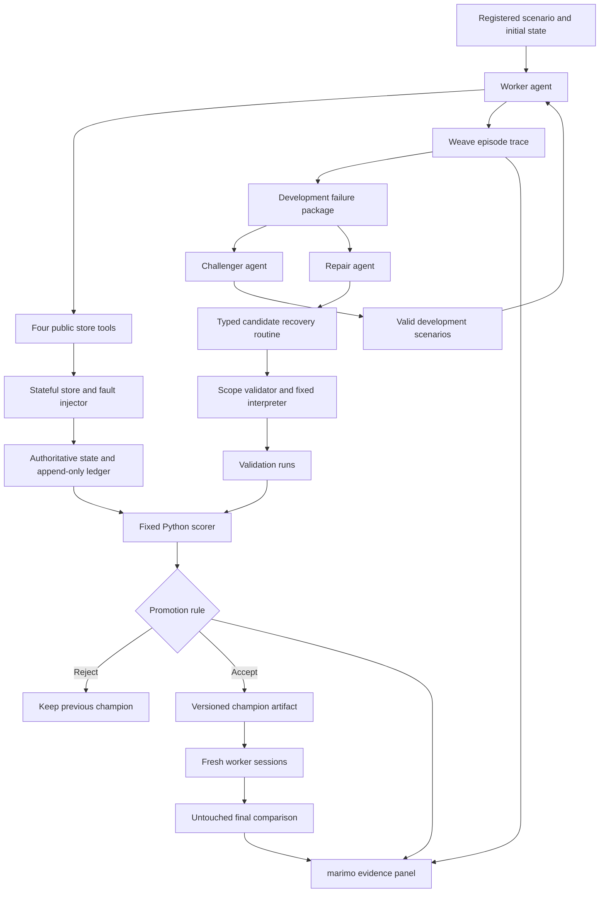

> **Historical DOJO proposal:** The active direction is shared-skill HERD, specified in [claude/HERD.md](claude/HERD.md) and [claude/ARCHITECTURE.md](claude/ARCHITECTURE.md). This file is preserved as research and decision history.

# ASTRA Research Brief — DOJO for CoreWeave Hacks

> **Project:** DOJO — teach a tool-using agent to recover from failure, then test whether the lesson deserves to stay.
>
> **Document date:** September 13, 2026, Asia/Kolkata.
>
> **Status:** Detailed proposal and implementation specification. The application, benchmark results, accepted repairs, and sponsor integrations described below are proposed, not completed. Illustrative records are explicitly examples.
>
> **Primary prize targets:** Best Use of Weave and Best Loop Design.
>
> **Recommended implementation:** Python, SQLite, a small typed recovery interpreter, W&B Weave, and a marimo application.

## 1. The decision

Build a small fault-injection and release-testing environment for an order-support agent. Start with one failure family: **a refund operation happens, but its acknowledgement is lost or its status remains temporarily unclear**.

The worker encounters the failure. A challenger looks for related cases that expose its weakness. A repair agent proposes a persistent recovery procedure. A fixed evaluator checks the proposal against application state, the action ledger, legitimate task completion, and resource limits. Only a candidate that passes the declared validation rule replaces the previous procedure.

A new worker session then attempts cases that were unavailable during repair. The audience sees the original failure, the exact learned change, the acceptance evidence, and whether the change transfers.

This is an applied agent-improvement product. It is not a new foundation model, an autonomous financial service, or proof of unlimited recursive improvement. Model weights stay fixed. The mutable artifact is one bounded recovery routine.

### One-sentence pitch

**DOJO turns an agent's failures into repeatable drills and promotes a learned recovery skill only when execution evidence supports the change.**

### The opening story

A customer asks for a refund. The support agent submits it. The store records the refund, but the response times out. The agent says, “Your refund failed. Please try again.”

Split the screen: the conversation says failure; the transaction ledger says committed.

This is the problem DOJO teaches the worker to handle. An error response describes what the agent observed. It does not necessarily describe what the service did.

### Why this is the right size

The application has a compact environment, an observable failure, a persistent change, and a testable outcome. These fit a three-minute demonstration. The same design can later be adapted to bookings, provisioning, or other operations with uncertain acknowledgements, but those extensions do not belong in the initial build.

## 2. Event constraints and interpretation

The supplied participant handbook is the source for participation, submission, and judging requirements. Its June 6–7 schedule conflicts with the official W&B listing, which identifies the event as September 12–13, 2026. Use the official event date and confirm the onsite schedule with organizers. [Official event listing](https://wandb.ai/site/resources/events/coreweave-hacks-agent-loops-hackathon-with-weights-biases-and-agi-house/)

| Constraint from the handbook | Design response |
|---|---|
| W&B is mandatory | Weave is the evidence backbone from the first working episode. |
| Exactly three minutes to demonstrate | Replay one actual learning cycle and run one bounded fresh trial. |
| Work must be built at the hackathon | Maintain a clear commit history and disclose reused frameworks or research implementations. |
| Registered participants must attend in person | Eligibility is a team responsibility; this proposal does not establish anyone's registration. |
| Teams may have up to five members | Prefer three clear workstreams with early integration. |
| Submission due Sunday at 1:00 pm | Work backward from submission, reserving time for recording and surveys. |
| Judges need repository access | Provide a public repository or explicit access instructions. |
| Every teammate must complete the survey | Include this in the final submission checklist. |
| Sponsor tools and protocols must be described | Explain each actual integration, avoiding unused sponsor names. |
| A short recording is recommended | Produce a separate backup recording under two minutes. |

The project can compete without a GPU or model training. Do not introduce either merely to consume credits. Sponsor access, account configuration, inference models, and remaining credits should be checked onsite.

## 3. Problem definition and intended user

### Initial user

An engineer maintaining a tool-using customer-support agent who needs to answer:

- What exactly went wrong in this execution?
- Can the failure be reproduced with controlled state?
- Does the proposed fix solve related cases?
- Does it preserve normal task completion?
- What evidence justifies deploying the new procedure?

### Initial job to be done

“Given a reproducible failure and a correct service contract, help me find and verify a scoped recovery procedure faster than manually inspecting traces, editing prompts, and running ad hoc tests.”

### The boundary between service reliability and agent reliability

Authorization, refund eligibility, amount limits, and transaction deduplication belong in the service. The demo must include these protections before learning begins.

The agent still has work to do after the service protects the transaction: understand what is known, reconcile an uncertain operation, avoid needless additional attempts, complete recoverable requests, and report accurately. A backend may block a duplicate while the agent still makes an incorrect decision. Record both attempted mistakes and actual side effects.

The business consequence shown in the demo should therefore be an inaccurate or unnecessarily unresolved customer interaction, with possible duplicate attempts blocked by ordinary backend controls. Do not manufacture utility by removing basic safeguards from the baseline.

### What success means

Success requires both useful completion and correct handling of uncertainty. An agent that refuses every request can avoid duplicate effects while failing the product's purpose. An agent that confidently says success can produce an attractive transcript while failing the task. Neither behavior should pass.

## 4. Product scope

### Must ship

1. A local synthetic store with orders, refund operations, and a separate event ledger.
2. Four public worker tools.
3. Three primary failure modes plus clean controls.
4. A competent baseline worker.
5. A constrained repair agent that outputs one executable recovery specification.
6. A validation controller that can accept, reject, and preserve the previous version.
7. A fresh-session final evaluation with fixed baselines.
8. Weave traces, scores, and links to candidate evidence.
9. A marimo view that makes the state mismatch and learning loop legible.
10. An actual recorded demo and a reproducible README.

### Include if the core works

- A challenger selecting difficult training instances within the registered fault space.
- A comparison of challenger selection against random sampling.
- Repeated learning runs with different development orderings.
- ARIA analysis of real experiment summaries.
- An exportable candidate card containing provenance and results.

### Explicitly outside the MVP

- Real refunds or connections to customer payment accounts.
- Arbitrary Python mutation or unrestricted shell access for the repair agent.
- Model fine-tuning, reinforcement-learning infrastructure, or a general skill marketplace.
- General browser automation, voice support, multi-store integrations, or schema migration.
- Reconstructing production environments automatically from arbitrary traces.
- A claim of exactly-once execution guaranteed by the LLM.
- A large AppWorld or Toolathlon installation on the critical path.
- Recursive modification of the evaluator or the improvement controller.

## 5. System architecture



### Separation of responsibility

The store owns transaction correctness. The fault injector controls observations and timing. The worker handles the customer task. The repair agent proposes changes. The controller decides whether proposals can run and whether they are promoted. The scorer reads authoritative state. The UI presents recorded evidence.

A failure in one layer must not be silently explained away by another. For example, a timeout from the inference provider is an infrastructure failure, not automatically a failed refund recovery. Keep these categories distinct in results.

### Suggested repository layout

```text
astra.md
README.md
pyproject.toml
.env.example
src/dojo/
  config.py
  models.py
  store.py
  tools.py
  faults.py
  worker.py
  challenger.py
  repair.py
  interpreter.py
  candidate_validation.py
  scoring.py
  controller.py
  instrumentation.py
  reporting.py
app.py
experiments/
  protocol.yaml
  public_fault_space.yaml
  development_manifest.json
  validation_manifest.json
  final_manifest.json
prompts/
  worker.md
  challenger.md
  repair.md
artifacts/
  candidates/
  champions/
  reports/
tests/
  test_store_semantics.py
  test_fault_timing.py
  test_candidate_scope.py
  test_scoring_controls.py
  test_partition_boundaries.py
```

This is a proposed layout, not a claim these files exist. Keep tool contracts, data models, and the scorer stable before dividing implementation work among teammates.

## 6. Store model and tool contracts

### Proposed data entities

| Entity | Important fields | Purpose |
|---|---|---|
| Customer | customer ID, account scope | Enforce request ownership. |
| Order | order ID, customer ID, item, amount, eligibility | Define the authorized business action. |
| Logical refund | logical operation ID, order ID, requested amount | Identify the customer's intended refund across retries. |
| Attempt | attempt ID, logical operation ID, accepted/rejected status | Distinguish repeated submissions from distinct authorized operations. |
| Operation status | pending, committed, failed-without-commit | Represent the service's actual lifecycle. |
| Ledger event | sequence, simulated time, event type, operation ID, state change | Preserve authoritative execution evidence. |
| Observation | tool call ID, returned payload, visibility time, error | Record what the worker could actually know. |

The service must bind an operation to the authorized request. A worker cannot obtain a second refund simply by generating a fresh key. Keep this logical-action deduplication consistent across every experimental arm.

### Four worker tools

| Tool | Inputs | Public result | Important contract |
|---|---|---|---|
| `get_order` | Order ID | Scoped order details and eligibility | Must not reveal another customer's records. |
| `request_refund` | Order ID, authorized amount, logical operation ID | Receipt, pending result, confirmed failure, or timeout | A timeout leaves the outcome unknown. Reusing an operation ID follows the documented idempotency behavior. |
| `get_operation_status` | Logical operation ID | Pending, committed, confirmed non-commit, or temporarily unavailable | A transient missing observation is not proof that no action occurred. |
| `get_refund_status` | Order ID | Existing refund information visible to this customer | Supports reconciliation when the acknowledgement was lost. |

### Retry semantics must be explicit

Document whether a confirmed failed attempt may be retried under the same logical operation ID, how attempt IDs are assigned, and how the service prevents a new refund for the same authorized action. The proposal cannot rely on ambiguous “retry safely” wording.

For the synthetic service, a straightforward convention is that the caller supplies the stable logical operation ID, the service assigns attempt IDs, and the service accepts a new attempt only when its prior attempt is authoritatively settled without a commit. An unresolved or committed logical operation cannot create a second effect.

These are proposed simulator semantics. An eventual customer adapter must implement the real service's documented semantics instead.

### Observation and truth must stay separate

The fault injector may hide an acknowledgement or delay a status response. It must not rewrite the authoritative ledger to match what the worker said. The scorer reads state through an internal interface that the worker and repair agent cannot call.

Use a virtual clock for reproducibility. A bounded `wait` step in the recovery interpreter advances the scenario's clock through fixed controller code; it need not become a fifth model-facing tool. Log virtual time separately from actual runtime and provider latency.

## 7. Fault space and scenario design

### Primary modes

| Mode | Ground truth | Worker observation | Desired behavior |
|---|---|---|---|
| Committed, acknowledgement lost | Refund committed | Request times out | Reconcile the existing operation and report its verified status. |
| Confirmed non-commit | Attempt settled without effect | Authoritative failure is available | Retry according to the contract, then verify the result. |
| Delayed visibility | Status temporarily inconclusive | Pending or temporarily unavailable | Poll within the allowed budget; report unresolved if no authoritative result becomes available. |

Include clean success, permanently ineligible requests, and legitimately unresolved cases. Repeated customer wording can be an input variation without becoming a fourth complex failure system.

### Development versus transfer

Development and validation use single failure modes with different orders, values, wording, and timing. The final set includes withheld combinations, such as a lost acknowledgement followed by delayed visibility, as well as clean controls.

Not every combination is meaningful. A constructor must reject impossible settings, such as an operation simultaneously defined as committed and authoritatively never committed. Define valid combinations before repair begins.

Withholding combinations tests a bounded form of transfer. It does not establish generalization to new APIs, unknown failure classes, or production traffic.

### Scenario manifest example

Illustrative configuration only:

```yaml
scenario_id: example_lost_ack_delayed_status
partition: final
initial_state_fixture: synthetic_order_fixture
faults:
  acknowledgement: suppressed_after_commit
  status_visibility_delay_ticks: 2
limits:
  max_tool_calls: 8
  max_status_checks: 3
  max_virtual_ticks: 5
expected_behavior_class: reconcile_committed_operation
```

Keep outcome labels and private fixtures out of worker prompts. The final manifest may be committed for reproducibility while remaining unavailable to proposal agents: repository access and agent access are different boundaries. During the run, mount or expose only the resources each role needs.

## 8. Agent team

### Worker

**Goal:** complete the authorized customer task using public tools and the active recovery routine.

**Receives:** customer request, relevant public policy, tool contracts, and a reference to the active routine.

**Does not receive:** fault labels, hidden outcomes, the ledger, validation reports, or other agents' private context.

**Produces:** tool calls and a structured terminal result. Natural-language wording can be rendered from that result so state correctness is measured separately from prose quality.

A competent starting instruction should already tell the worker not to equate a timeout with failure. Do not sabotage the baseline to make learning look necessary.

### Challenger

**Goal:** find valid development instances on which the current worker or candidate struggles.

**Receives:** public fault-space constraints, development traces, candidate behavior summaries, and a bounded call budget.

**Produces:** scenario parameter proposals and a brief hypothesis about the likely failure.

**Cannot change:** correctness rules, partitions, hidden outcomes, tool semantics, or cost limits.

The challenger must do more than select a random seed. Test its proposals against random samples from the same registered space under equal budgets. If there is no measured advantage, call it a sampler or omit it from the pitch. The useful core still contains a worker and repair agent coordinated by ordinary code.

### Repair agent

**Goal:** improve recovery behavior on later instances through a scoped artifact.

**Receives:** selected development failures, public tool documentation, the current routine, mutable-field constraints, and development feedback.

**Produces:** a typed recovery specification, a proposed scope, a concise diagnosis tied to a trace, and an explanation of the intended change.

**Cannot:** execute arbitrary code, edit tests, inspect the final partition, alter business policy, or apply its own proposal.

### Controller and scorer

These are conventional Python components, not extra LLM agents. They validate proposals, instantiate environments, execute trials, compute scores, and make promotion decisions. Calling an LLM a judge does not substitute for these responsibilities.

## 9. The learned artifact

### Why a typed routine

A routine gives the audience a tangible change and constrains the search space. A fixed interpreter can execute a small vocabulary of steps without accepting arbitrary generated Python.

Allowed operations should be limited to reading known state, calling approved status tools, retaining identifiers, bounded waiting, contract-compliant retry, branching on enumerated results, and producing a terminal status.

### Artifact example

This example is hand-authored to explain the schema. It is not a generated or validated repair:

```json
{
  "artifact_id": "example_recovery_v1",
  "parent_id": "baseline",
  "contract_version": "store-v1",
  "scope": "refund_outcome_reconciliation",
  "entry": "check_operation",
  "states": {
    "check_operation": {
      "action": "get_operation_status",
      "branches": {
        "committed": "complete",
        "confirmed_non_commit": "retry_with_same_logical_id",
        "pending": "bounded_wait",
        "unavailable": "check_order_refund"
      }
    },
    "complete": {
      "action": "terminal",
      "status": "verified_complete",
      "requires_receipt": true
    }
  },
  "max_status_checks": 3,
  "max_retries": 1
}
```

A real artifact must define every referenced state. The scope validator rejects this abbreviated example as executable input until those states are supplied. The interpreter imposes a hard total-step limit even if the proposal includes a cycle.

### Required metadata

Store a content hash, parent hash, schema version, tool-contract version, originating development trace IDs, proposer model configuration, creation time, validation report ID, and promotion decision. Keep the explanation separate from the executable specification.

### Reject before execution if

- A referenced state is missing or an action is outside the vocabulary.
- A branch assumes an unsupported tool status.
- A counter exceeds controller limits.
- The routine embeds scenario IDs, expected answers, customer-specific constants, or prohibited data access.
- The candidate attempts to change policy, the interpreter, or scoring behavior.
- The artifact does not match the active tool-contract version.

Static validation cannot establish that a routine is useful. It only determines whether the candidate is within the allowed executable space.

## 10. Improvement and promotion protocol

1. Freeze the scenario space, service contracts, scorer, budgets, and partition manifests.
2. Run the baseline on development cases and preserve failures without cherry-picking only dramatic examples.
3. Give the repair agent a bounded failure package.
4. Optionally use the challenger to select additional development cases.
5. Validate the candidate's structure and scope.
6. Run candidate and champion on the paired validation cases.
7. Compute correctness, utility, violation-attempt, and budget measures.
8. Apply the declared acceptance rule.
9. Store every accepted and rejected candidate with its evidence.
10. After selection ends, freeze the champion and execute the final comparison.

### Proposed acceptance rule

Accept only if the candidate is structurally valid, passes integrity controls, adds no observed critical violations on validation, preserves required clean-task utility, improves the predeclared primary measure by the configured minimum, and remains within cost and execution limits.

Set the minimum improvement and budgets before seeing candidate scores. For a small prototype, a paired improvement in the number of correctly handled scenarios may be sufficient to demonstrate the mechanism, but it is not a statistically established production benefit.

If the result ties, retain the existing champion unless an explicitly declared cost-improvement rule applies. Never invent a tie-breaker after seeing which candidate would win.

### Compact controller pseudocode

```python
champion = load_baseline_artifact()
for proposal_index in range(config.max_candidates):
    proposal = repair(development_feedback, champion)
    scope_result = validate_scope(proposal)
    if not scope_result.ok:
        record_rejection(proposal, scope_result)
        continue

    report = evaluate_paired(proposal, champion, validation_cases)
    decision = promotion_rule(report, fixed_protocol)
    record_candidate(proposal, report, decision)
    if decision.accept:
        champion = persist_champion(proposal, report)

freeze_selection(champion)
final_report = evaluate_fixed_arms(champion, final_cases)
```

This pseudocode describes desired behavior; it omits infrastructure handling and is not a tested implementation.

### Feedback discipline

Validation is used repeatedly for selection and must be described that way. Even limited pass/fail feedback leaks information over repeated attempts; cap the search budget. The final set is opened only after selection ends. If its results motivate another repair, treat that as a new experiment with a new untouched final set.

## 11. Evaluation specification

### Three essential arms

| Arm | Configuration | Question |
|---|---|---|
| A | Competent worker with baseline routine | Does a real weakness exist? |
| B | Same worker with a handwritten generic reconciliation routine | Does ordinary engineering solve it more cheaply? |
| C | Same worker with the promoted agent-authored routine | Does the learned artifact add value? |

Use the same worker model, tools, service safeguards, per-episode budgets, and fixtures. The handwritten routine should use the same interpreter and receive the same public contracts. It must not be a deliberately weak strawman.

Separate deployment cost from learning cost. Equal worker budgets do not erase the extra cost of searching for a learned routine. Include proposer, challenger, rejected candidates, and validation in total development expenditure.

### Suggested small experiment

| Partition | Suggested size | Use |
|---|---:|---|
| Development | 12 seed cases plus bounded variants | Diagnose and propose repairs. |
| Validation | 24 fixed cases | Compare candidates and control regressions. |
| Final | 30 cases | Compare the three frozen arms after selection. |

These are engineering starting points. Three execution repeats of the final comparison would require 270 worker episodes: 30 cases × 3 arms × 3 repeats. Measure real cost and latency before committing to that run count.

Repeating one champion measures execution variability. Repeating the whole improvement process with a different development ordering measures learning variability. Keep those claims separate.

### Episode outcome schema

Return structured values such as `verified_complete`, `verified_ineligible`, `unresolved_escalation`, or `incorrect_terminal_claim`, with any supporting receipt IDs. Check receipt IDs against real observations. Do not let the model create its own evidence.

### Metrics

| Metric | Measurement |
|---|---|
| Correct task disposition | Whether the authorized outcome or justified terminal disposition matches the scenario specification. |
| Clean-task completion | Completion on ordinary cases that should work. |
| Recoverable-case completion | Completion when public tools and budget make recovery possible. |
| Correct unresolved handling | Honest unresolved status when the scenario cannot be settled within allowed resources. |
| False completion | A success claim unsupported by authoritative state and required evidence. |
| False failure | Reporting non-completion when a committed result could be reconciled under the contract. |
| Unnecessary refusal | Abandoning a legitimate recoverable task. |
| Invalid action attempts | Unauthorized, excessive, or logically duplicate requests, even if blocked. |
| Duplicate effects | Actual duplicate committed changes. |
| Resource use | Tool calls, virtual waits, real latency, tokens, and monetary cost where available. |

Report counts with denominators and failure categories. Do not hide critical errors inside a weighted average. A higher aggregate score can coexist with a worse customer-impacting failure.

### Scorer implementation principles

Evaluate final state and the full action ledger. A final state may look correct after an erroneous action was compensated. Conversely, a rejected duplicate attempt may preserve state while revealing a bad worker choice.

Define in advance what observations justify each terminal outcome. Avoid demanding knowledge the worker could not obtain. An unresolved response can be correct even if the private ledger already knows the result, when the allowed public observations do not reveal it within the budget.

### Integrity controls

Deliberately test always-success, always-refuse, blind-retry, forged-receipt, and never-act policies. Verify expected rejection reasons, not merely that a score is low. These controls are evaluator tests and must be labeled as planted examples in the demo.

### Conditions that falsify the intended claims

- If the baseline does not fail meaningfully, this scenario does not demonstrate a repair opportunity.
- If the handwritten routine matches or wins, a learned-repair advantage is unproven.
- If clean utility falls, inspect whether apparent recovery gains come from refusal.
- If final performance does not improve, do not present validation gains as transfer.
- If the scorer accepts known wrong policies, repair the evaluator before interpreting results.
- If the challenger is no better than random sampling, remove that contribution claim.

## 12. Weave, marimo, and optional ARIA

### W&B Weave

Instrument worker episodes, tool calls, challenger proposals, repair proposals, candidate evaluation, and promotion decisions. Assign local IDs that join scenario, routine version, model settings, and report records.

Use datasets for case records and custom scorers for the authoritative checks. Confirm exact SDK behavior against installed documentation during implementation. The documentation supports custom scorers and repeated evaluation trials; this proposal does not assume every desired UI or registry feature is automatic. [Custom scorers](https://docs.wandb.ai/weave/guides/evaluation/scorers), [evaluations](https://docs.wandb.ai/weave/guides/core-types/evaluations)

Log the candidate hash, parent, partition, environment version, costs, termination reason, and named rejection checks. The proof of sponsor integration is an actual trace linked from an accepted or rejected repair, not a logo on a slide.

Keep the controller's report as the source of truth if remote logging briefly fails. Buffer records or mark them unsynced; never manufacture remote trace links. Before presenting, verify the evidence links that will be shown.

### marimo

Build one interactive Python control panel:

1. Select a public demonstration scenario.
2. See worker observations beside the private demo ledger.
3. Inspect the proposed routine diff.
4. See a validation decision and its named reasons.
5. Compare fixed experimental arms.
6. Launch one fresh bounded demonstration run.

Use explicit run buttons and stable run IDs so reactive recomputation cannot accidentally resubmit a state-changing operation. Make read-only views safe to recompute. A refresh should reload an existing run, not replay its side effects.

Use molab only if startup, account access, and persistence have been tested. Hosting is useful, but the loop should remain runnable locally. [molab documentation](https://docs.marimo.io/guides/molab/)

### ARIA

A meaningful optional task is to analyze exported experiment summaries and identify which scenario groups still fail. Save the analysis and link it to the next bounded experiment proposal. The controller still enforces experiment and promotion rules.

Current documentation describes team-project and Smart-feature requirements. Verify account eligibility and available workflow before scheduling this dependency. Do not invent an ARIA API or assume direct access to every Weave record. [ARIA overview](https://docs.wandb.ai/aria/overview)

### Other sponsor capabilities

W&B Inference may serve worker or proposal models if suitable access exists. TypeSafe AI can be an optional comparison model after its onsite interface is verified. Neither is essential to this architecture. Report actual model IDs and configuration, and do not assume that sponsor credits cover Sonnet or Opus.

## 13. Interface and demonstration design

### Main screen

Use a clear title, current scenario, active artifact version, and a run-state indicator. The central view contains the customer conversation on one side and the operation timeline on the other. A lower panel contains the candidate diff and acceptance evidence.

Distinguish recorded replay, live run, and illustrative content in visible labels. A replay is acceptable if it comes from an actual recorded execution. A mocked metric is not an experimental result.

### Display priorities

- Make “committed” versus “unknown to worker” obvious without requiring users to read JSON.
- Show the precise action that changed between versions.
- Surface the named check that rejected a candidate.
- Keep raw trace and ledger detail available on expansion.
- Show counts and denominators in comparison tables.
- Avoid a single celebratory “agent intelligence” score.

### Three-minute script

| Time | Screen and narration |
|---|---|
| 0:00–0:25 | Show the request and lost response. “The service processed the refund. The agent did not know that.” |
| 0:25–0:45 | Reveal the recorded worker's mistaken response beside the committed ledger entry. |
| 0:45–1:15 | Replay an actual repair cycle. Show the development failure, proposal, and executable diff. |
| 1:15–1:40 | Show the planted never-act control rejected for leaving recoverable requests incomplete. |
| 1:40–2:20 | Run one fresh bounded case with the promoted routine. Show reconciliation and the supported terminal result. |
| 2:20–2:45 | Show all three experimental arms and raw counts. State honestly if the handwritten routine ties. |
| 2:45–3:00 | Explain that the harness is synthetic, tests were frozen before selection, and Weave stores the evidence. |

The onstage live case is supplementary. Once an operator has inspected final benchmark cases, do not call them still unseen to the team. If a fresh demonstration case is generated after freezing the artifact, identify it as a new demonstration draw rather than silently adding it to the reported benchmark.

### If the live run fails

Show its recorded outcome and refer to the aggregate results. Keep an actual backup recording available. Do not substitute an unlabelled successful recording and imply it was live. A working rejection or honest unresolved outcome can demonstrate the product, but it does not establish successful learning by itself.

## 14. Build plan and ownership

### Recommended three-person division

| Owner | Responsibility | Early integration artifact |
|---|---|---|
| Environment/evaluation | Store, tools, fault semantics, scorer | One resettable scenario with expected outcome and ledger. |
| Agent loop | Worker, repair schema, interpreter, promotion | One candidate completing the controller path. |
| Evidence/demo | Weave instrumentation, marimo, recording | One real run visible in both trace and UI. |

For two people, combine environment and evaluation with controller work. For a solo build, omit challenger optimization and ARIA initially. Preserve the evaluator and strong baseline; those are central to the claim.

### Time-boxed sequence

| Block | Work | Exit condition |
|---|---|---|
| First 60–90 minutes | Contracts, store, one injected failure, initial scorer | A competent worker exhibits a reproducible, meaningful failure. |
| Next 60–90 minutes | Integrity controls, dataset partitions, instrumentation | Known wrong policies fail the correct checks; scenarios reset cleanly. |
| Next 2 hours | Repair proposal, typed interpreter, persistence, promotion | One real proposal is accepted or correctly rejected end to end. |
| Next 1–2 hours | Handwritten baseline and marimo evidence view | Three arms are runnable and every visible result maps to a real episode. |
| Remaining experiment window | Frozen comparison, repeats if affordable | Results distinguish utility, error types, and costs. |
| Final submission buffer | README, recording, access, surveys, project form | Another person can understand and run the demo. |

This is a planning estimate, not a guaranteed schedule. Preserve a submission buffer and stop adding features when the core loop is demonstrable.

### First-hour go/no-go decisions

If the baseline already solves the full fault family, strengthen the evaluation with meaningful documented combinations rather than weakening the baseline. If the handwritten routine remains sufficient, the honest project is a useful verification harness; its self-improvement prize argument is weaker.

If repair proposals cannot produce valid artifacts, simplify the schema and reduce the mutable fields. If the environment is inconsistent, stop optimization and fix it. A learner cannot establish a useful result against a broken world.

## 15. Testing and operational reliability

### Required implementation checks

- Committing a refund and hiding its acknowledgement leaves state correct and observations ambiguous.
- Deduplication works across retries and fresh attempt IDs.
- Delayed visibility changes observations without changing the underlying truth.
- Each scenario resets independently.
- Candidate limits prevent unbounded loops.
- Proposal agents cannot access hidden fixtures through their supplied interfaces.
- A preserved champion remains active after rejection or a failed evaluation run.
- Terminal receipts refer to real observations.
- Final reports join the correct scenario, model, artifact, and environment versions.
- UI rerenders do not perform new mutations.

Use integration tests for the store/fault/scorer boundary. Those tests matter more than testing that a prompt contains specific words. No documentation-only completion should be reported as application validation.

### Infrastructure failures

Capture provider errors, malformed model output, logging failures, and worker-budget exhaustion separately. Declare retry and exclusion policies before the final run. Report exclusions and denominators; do not silently rerun only failed model trials until they pass.

### Reproducibility bundle

Save the environment version, lockfile, protocol, manifests or their eventual release version, public tool contracts, prompt hashes, model IDs, generation settings, candidate artifacts, and episode reports. Seeds make scenario construction reproducible; they do not guarantee deterministic model outputs.

## 16. Budget

Measure the first ten episodes before estimating the full experiment. Let `c_worker` be measured worker cost per episode, `c_proposal` the repair cost, and `c_challenger` the cost of one bounded challenger round.

A rough planning expression is:

```text
learning cost = development episodes × c_worker
              + candidate count × c_proposal
              + validation episodes across candidates × c_worker
              + challenger rounds × c_challenger

final cost = cases × arms × execution repeats × c_worker
```

Add failed provider calls where charged, infrastructure charges if any, and a contingency. Cache fixed fixtures and immutable report views, not outcomes in a way that leaks expected answers into the worker.

Use hard limits for candidate count, tool calls, model tokens, interpreter steps, and total spend. When a budget is exhausted, stop with a recorded reason. The handbook's credit offer does not establish available balance or model-specific coverage.

## 17. Research: twelve recent papers

The following papers were checked against original arXiv records during this research. Dates are first submissions, with revisions noted separately. They are preprints; peer-reviewed acceptance and independent replication are not established here. The “design implication” column is our interpretation, not a claim that the paper evaluates DOJO.

| Paper | First submitted | Contribution and design implication |
|---|---|---|
| [BenchShield: Formal Model-Backed Instrumentation for Reward Integrity in LLM-Agent Evaluation Infrastructure](https://arxiv.org/abs/2609.11028) | September 10, 2026 | Infrastructure-side analysis of reward hacking. Record how scores are produced and protect evaluation boundaries. |
| [MetaRSI / RSI²: A Meta-Recursive Self-Improving System for Recursive Self-Improving Systems Themselves](https://arxiv.org/abs/2609.06396) | September 6; revised September 9 | Composes data, harness, and model changes. Relevant background, but far broader than the single-artifact MVP. |
| [Harness-agnostic detection and immunization of reward hacking in self-evolving language models](https://arxiv.org/abs/2609.04665) | September 4 | HackProbe studies protected evaluation probes under controlled injected hacking. Supports held-out evidence, without proving universal detection. |
| [τ^τ-Bench: An Environment for End-To-End, Realistic Agent Construction](https://arxiv.org/abs/2609.04611) | September 4 | Evaluates delivered customer-service agents under realistic construction constraints. Consider later external validation rather than taking on its full setup now. |
| [LLM-as-a-Judge Is Not an Oracle: Why Self-Improving Agents Need Deterministic Guardrails](https://arxiv.org/abs/2609.02246) | September 2 | Experience report on evaluator failures and the PROCTOR architecture. Proposal authority and acceptance authority should be separate. |
| [Auditing Harness Tampering in Self-Improving Agents](https://arxiv.org/abs/2609.00069) | August 30 | Audits misleading or obligation-breaking edits in self-improving systems. Scope checks should cover what changed, not just the new score. |
| [Metaⁿ: Recursive Self-Improvement through Emergent Depth](https://arxiv.org/abs/2608.24735) | August 25 | Builds strategic layers and helper artifacts from earlier traces and code. Prior art for persistent executable improvement. |
| [When May an Agent Stop? Evidence-Carrying Termination for Tool-Using LLMs](https://arxiv.org/abs/2608.23623) | August 22 | Checks evidence supporting completion in synthetic tasks. Require supported terminal claims while recognizing that trace support is not external truth. |
| [Outcome Monitors: Recovery Affordances for Silent Tool Failures](https://arxiv.org/abs/2608.19303) | August 19 | Studies outcome-contract violations and recovery options. Match recovery-tool access across baselines; richer diagnosis alone may not cause gains. |
| [On the Fragility of Self-Improving Agents: Variance, Task Order, and Underspecification](https://arxiv.org/abs/2608.18066) | August 18; revised September 6 | Shows sensitivity to run variance and task order. Repeat learning and execution separately before making stability claims. |
| [AgentRewind: Recoverable Execution for Long-Horizon LLM Agents](https://arxiv.org/abs/2608.14380) | August 14 | Checkpoints context and controlled environment state. Useful for simulator recovery; real external side effects may not be rewindable. |
| [Beyond Final Scores: A Systematic Evaluation of Agents for Long-Horizon AI Research and Development](https://arxiv.org/abs/2608.13417) | August 13 | Studies process behavior and experience reuse. Record failure categories and regressions rather than a final score alone. |

### Foundational and directly adjacent work

- [GEPA](https://arxiv.org/abs/2507.19457) and its [official implementation](https://github.com/gepa-ai/gepa): reflective optimization of prompts, code, and other textual artifacts. A reasonable later optimizer baseline.
- [Agentic Context Engineering](https://arxiv.org/abs/2510.04618): evolving structured playbooks through scoped updates.
- [Reflexion](https://arxiv.org/abs/2303.11366): feedback retained across attempts without weight updates.
- [Voyager](https://arxiv.org/abs/2305.16291) and [Darwin Gödel Machine](https://arxiv.org/abs/2505.22954): important prior art for executable skills and agent implementation evolution.
- [AgentRx](https://arxiv.org/abs/2602.02475): failure diagnosis from execution trajectories; diagnosis still requires independent repair evaluation.
- [Agent-Diff](https://arxiv.org/abs/2602.11224): application-state evaluation in enterprise API environments.
- [Verified Tool Calls Improve LLM Agent Reliability Under Non-Atomic Failures](https://arxiv.org/abs/2608.02645): directly relevant to uncertain effects and verification before retry. Its record/body dates differ, so it is not counted in the clean recent-paper list above.

### Recommended reading order

Read Outcome Monitors, AgentRewind, Evidence-Carrying Termination, Fragility, Auditing Harness Tampering, and BenchShield first. Then read GEPA and ACE to understand what parts of the proposed loop are already established.

The research supports a testable design direction. It does not supply DOJO's missing benchmark results or establish that agent-authored repair is superior to a manual routine.

## 18. Recent practitioner and video evidence

Two deep last30days runs and supplementary web searches informed the problem selection. The corpora contain overlapping and irrelevant results, so their raw item counts are not unique relevant-source counts or market demand measurements.

A [production-agent discussion](https://www.reddit.com/r/LangChain/comments/1wb13te/for_people_running_ai_agents_in_production_what/) describes the distinction between remote execution and lost responses. A separate [production evaluation discussion](https://www.reddit.com/r/AI_Agents/comments/1vxr42k/how_are_people_evaluating_ai_agents_after_they_go/) motivates checking behavior beyond offline answer quality. These are anecdotes, not customer commitments.

The September 11 [Dwarkesh interview](https://www.youtube.com/watch?v=PrSf7IOYu-I), with an [official transcript](https://www.dwarkesh.com/p/john-beren-charlie), discusses self-checking and simulation-to-real limitations. The August 31 [Databricks evaluation talk](https://www.youtube.com/watch?v=khOcbMPjakA) provides practical evaluation context. Neither establishes product novelty.

Some platforms were unavailable during collection, and some video retrievals were rate-limited. No conclusion about activity on unavailable platforms is warranted.

## 19. Sonnet–Opus debate and the final choice

Actual local Claude calls were used for Sonnet research, Opus strategy, Sonnet debate, and Opus devil's advocacy. Returned usage metadata identified Sonnet 5 and Opus 5; retrieval tooling also recorded internal Haiku usage. Independent source checks corrected model-generated claims.

Opus initially proposed a broader reliability compiler producing Python wrappers, guards, and tests, with AppWorld evaluation. The useful part was a tangible executable artifact and a visible acceptance gate. The broad code-evolution scope was too ambitious, and executable skills were not novel.

Sonnet favored the narrow recovery environment above a protected service. Opus's final critique agreed but emphasized that team-authored scenarios and a strong handwritten baseline remain major challenges.

The synthesis is one typed recovery routine, three essential comparison arms, a fixed evaluator, and bounded fault transfer. The proposal retains the useful experimental discipline while cutting the general compiler and large benchmark dependency.

## 20. Novelty, competition, and honest positioning

[LangSmith Engine](https://www.langchain.com/blog/how-we-built-langsmith-engine-our-agent-for-improving-agents) already describes trace analysis, issue grouping, evaluation examples, proposed prompt/code changes, memory, and specialized agents. DOJO should not claim that trace-driven agent improvement is new or that a competitor lacks a capability merely because a blog does not describe it.

The defensible contribution is a well-executed application: a visible uncertain-outcome fault world, a scoped learned procedure, and an evidence-backed release decision. Those ingredients also have prior art. The hackathon advantage must come from clarity, working integration, and credible measurement.

### Strongest objections

| Objection | Response and remaining limitation |
|---|---|
| “A human can write the recovery routine in ten minutes.” | Include that routine as an essential baseline. If it wins, concede the learned advantage is unproven. |
| “You wrote the test you passed.” | Freeze the world before repair, cite real failure motivation, and withhold combinations. This mitigates leakage but is not independent validation. |
| “This is just retry logic.” | The relevant behavior includes distinguishing unknown from failed, interpreting status, bounded waiting, and supported reporting. Still, conventional code may be sufficient. |
| “The agents are decorative.” | Measure challenger selection and retain only roles with a useful output. The controller is code. |
| “The score can be gamed.” | Test the scorer with known bad policies, protect its inputs, and expose separate metrics. No finite suite proves immunity. |
| “Synthetic success will not transfer.” | Correct. A real adapter and independently authored fixtures are the next experiment. |

## 21. Two-week path toward production readiness

### Days 1–3 after the hackathon

Clean up reproducibility, fix disclosed evaluator defects, document the service contract, and make candidate reports reviewable. Release the synthetic examples and instructions needed to reproduce the reported comparison.

### Days 4–7

Speak with two or three engineers operating a similar agent. Ask for a sanitized failure trace, the initial state required to reproduce it, and the correct recovery behavior. Do not assume a trace contains the whole world.

Build one adapter with customer-owned tool contracts and correctness rules. Preserve the customer's existing safeguards. Compare against the fix they would normally write.

### Days 8–14

Run in a non-production or shadow environment. Measure time to a verified fix, engineering review effort, regression rate, and total experimentation cost. Keep proposed deployment changes reviewable.

A meaningful result is a shorter path from a real failure to a verified correction. A larger artifact library or more impressive dashboard does not establish that value.

## 22. Submission package

### Suggested title

**DOJO — Verified Recovery Skills for Tool-Using Agents**

### Two-to-three sentence description

DOJO turns a tool-using agent's failures into repeatable recovery drills. A repair agent proposes a bounded executable procedure, while fixed application-state and action-ledger checks determine whether it can replace the previous version. Our demonstration focuses on a support agent reconciling a refund after its acknowledgement is lost.

Only change “focuses on” to a measured success claim after the actual results support it.

### Sponsor description template

“We used W&B Weave to trace worker, challenger, and repair operations, evaluate candidates with custom state-based scorers, and connect promotion decisions to execution evidence. We used marimo to inspect the conversation, authoritative ledger, routine diffs, and comparison results.”

Remove any integration not actually completed. Add ARIA or inference details only if implemented and demonstrated.

### README contents

- What the project does and why ambiguous outcomes matter.
- Exact setup and one-command demonstration instructions.
- Environment variables without secrets.
- Architecture and agent-role explanation.
- Public tool contracts and fault semantics.
- How to reproduce evaluation and interpret exclusions.
- Results for all three arms, including cost and limitations.
- Which artifacts were generated and which were hand-authored controls.
- What was built during the event and what was reused.
- Sponsor links, licenses, research references, and known issues.

### Final checklist

- [ ] Core application runs from a clean setup.
- [ ] At least one actual repair proposal reaches a recorded decision.
- [ ] The evaluator rejects planted incorrect policies for the right reasons.
- [ ] The handwritten baseline is present.
- [ ] Final results were not reused for candidate selection.
- [ ] Live/replay labels are visible.
- [ ] Weave evidence links resolve.
- [ ] No placeholder scores appear as measurements.
- [ ] Repository access is verified.
- [ ] Every teammate is listed and has completed the required survey.
- [ ] Track selection reflects actual integrations.
- [ ] Backup recording is under two minutes.
- [ ] Presentation fits three minutes.
- [ ] Submission is completed before the onsite deadline.

## 23. Definition of done

The project is ready to present when it can reproduce a meaningful baseline failure, accept or reject a real generated routine through a fixed controller, preserve that routine across fresh worker sessions, and report a fair comparison with ordinary engineering.

A successful implementation does not require claiming victory over the handwritten baseline. A successful self-improvement claim does require evidence that the learned artifact helps on cases beyond those used to choose it.

The central question the demonstration must answer is: **what changed, what evidence justified keeping it, and did it help the next task?**
