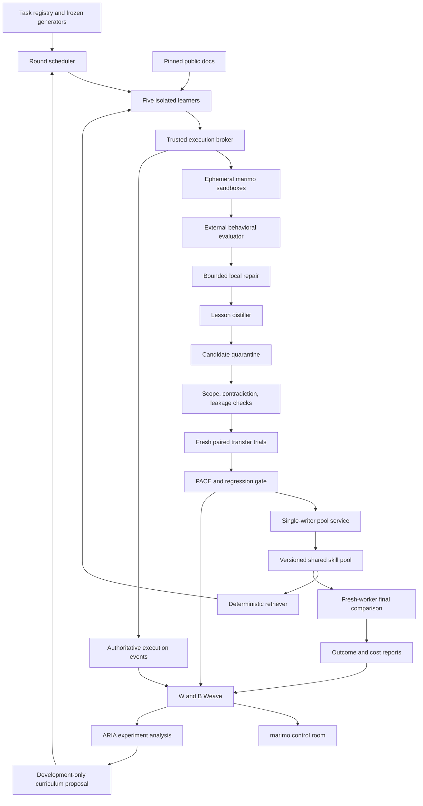

# HERD v2 — Shared tool-learning architecture

> **Active specification.** Five learner agents, three rounds, marimo tasks, verified repairs, ACE-style lesson records, PACE-style admission, shared pool, Weave, marimo control room, and ARIA analysis. The application is not implemented by this document.
>
> Product rationale: [HERD.md](HERD.md). Statistical contract: [GENERALITY.md](GENERALITY.md). Execution plan: [BUILD_PLAN.md](BUILD_PLAN.md). Reference defaults: [protocol.json](protocol.json).

## 1. Architectural decisions

| Decision | Choice | Reason |
|---|---|---|
| Learning surface | Retrieved procedural lessons in context | Makes persistent change portable without model training. |
| Worker population | Five isolated learner identities | Distributed experience across complementary marimo tasks. |
| Learning duration | Three synchronized rounds | Produces observable pool versions and cross-origin reuse. |
| Task domain | Pinned marimo runtime and dependency image | A real tool with executable, interactive outcomes. |
| Evaluator | Fixed external behavioral runner | The learner cannot improve its score by changing the test. |
| Lesson format | Versioned JSON with ACE-style helpful/harmful evidence | Small, inspectable updates rather than entire prompt rewrites. |
| Admission | Scoped validity checks, paired sequential evidence, fixed regression controls | Separates plausibility from measured benefit. |
| Pool authority | One trusted pool-service writer | Learners cannot self-publish. |
| Synchronization | Immutable round snapshots and atomic promotion records | Every learner's exposure is reconstructible. |
| Headline | Fresh-worker success, pool versus no pool | Measures transfer rather than remembered local retries. |
| Model strategy | One fixed worker configuration for the primary experiment | Model swaps must not masquerade as learning. |
| Build collaboration | Astra and Fable work against frozen interfaces | Parallel implementation preserves one coherent system. |

## 2. Invariants

- **I1 — fixed evaluator:** candidate notebooks and lessons cannot modify the trusted task specification, evaluation probes, scorer, or gate.
- **I2 — single pool writer:** only the pool service can activate, supersede, or retract lesson versions.
- **I3 — frozen comparison:** a gate stream binds to candidate content, incumbent pool, retriever, model, docs, task distribution, and runtime hashes.
- **I4 — fresh evidence:** no admission task or worker session is reused as a new independent observation.
- **I5 — isolated transfer:** final workers have empty session histories and no access to source repair artifacts or other arms.
- **I6 — behavior over claims:** correctness is established from notebook execution and required interactions, not model narration or exit status alone.
- **I7 — evidence-bound sharing:** unadmitted lessons stay quarantined; runtime-invalidated lessons cannot be silently injected.
- **I8 — equal resources:** all comparison arms use the same tools, docs access, model configuration, and attempt budget.
- **I9 — explicit uncertainty:** quarantine, insufficient evidence, provider failure, and task failure are different states.
- **I10 — no invisible mutation:** a changed lesson, retrieval policy, or runtime creates a new version and invalidates incompatible prior admission claims.
- **I11 — full scope:** all five learners and three rounds remain in the release target; deferred execution after a budget stop is reported as incomplete.
- **I12 — no invented outcomes:** pool growth, success lift, token savings, and sponsor integration are measured or explicitly marked unavailable.

## 3. Component topology



ARIA recommendations can alter development emphasis within approved tracks. They cannot change final distributions, labels, worker budgets, or gate outcomes. The diagram's feedback edge represents a logged controller decision, not unrestricted ARIA execution authority.

## 4. Domains and deployment topology

### Trusted host services

Run the scheduler, model gateway, task registry, evaluation controller, evidence writer, trial controller, and pool service outside learner-controlled environments. They hold provider and Weave credentials. The browser automation controller also runs outside the notebook container.

A learner LLM receives a restricted tool interface through the gateway. Generated notebook code executes in an ephemeral container with no provider keys, no W&B keys, no host home-directory mount, no Docker socket, and no access to evaluation databases. The model gateway, not the candidate notebook, makes inference calls.

Use one immutable runtime image shared across experiments. Linux containers can run through Docker Desktop or a verified Linux host; the deployment must pass the isolation and browser-connectivity checks on the chosen machine. The architecture does not depend on the earlier harden-v0 Linux pool transport.

### Candidate sandbox

Expose writable `/workspace`, read-only public fixtures and cached packages, a restricted output directory, and the notebook's assigned server port. Enforce CPU, memory, process, file-size, and wall-time limits. Disable external egress for candidate code. The trusted broker serves documentation queries; the notebook does not need the internet.

Browser traffic from the trusted evaluator may reach the notebook's allocated port. That does not grant the notebook network access to the controller's other services. Explicitly test this boundary.

### Evidence boundary

Capture commands, arguments, process exit status, output hashes, artifact hashes, browser events, and observed values at the runner boundary. Do not treat a learner-created `results.json` as an authoritative result.

An append-only hash-linked event file can detect changes relative to a retained checkpoint. It is not remote attestation, does not establish truth before capture, and cannot prevent a trusted operator from rewriting all history. The scope is a reproducible experiment operated by a trusted team.

## 5. Task registry

Each task consists of:

```text
TaskManifest
  task_id, template_id, family_id, partition
  public_request, public_fixture_hash, public_skill_tags
  runtime_lock_hash, docs_snapshot_hash
  oracle_version, private_probe_manifest_hash
  intended_difficulty, allowed_packages
  action_budget, token_budget, time_budget
  origin_exclusions, assignment_seed
```

Public tags describe requested features, such as a table or slider; they must not encode the correct repair or a hidden failure label. The same public metadata is available to every arm.

### Five tracks

1. Notebook structure and names.
2. Widget-driven computation.
3. Data transformation and dependency behavior.
4. Forms and controlled execution.
5. Composition, app startup, and delivery.

Tasks combine tracks in later rounds. Do not add unsupported claims about specific API behavior: each task needs a reference notebook checked against the pinned runtime and relevant official documentation.

### Round assignment

Each learner receives three development tasks per round, for 45 development episodes in total. Round one emphasizes different primary tracks. Round two rotates tracks by a fixed schedule. Round three combines two previously introduced capabilities. Each cell sees the same round pool revision but disjoint development task IDs.

A proposed deterministic rotation is `(learner_index + round_index) mod 5`. Task contents still vary by fixture and template. Track order is an explicit curriculum, not a neutral default; repeat runs with alternative orderings before claiming order-robust learning.

### Fixture validation

For every template, execute a legitimate reference notebook and at least one known wrong implementation. Validate both initial output and interactions. A template enters the registry only if the reference passes and the planted defect fails the intended check. Store the validation event.

Wrong implementations should include hardcoded output, a nonreactive screenshot-like result, a widget disconnected from computation, a suppressed error, and an empty notebook. These are evaluator controls, not alleged spontaneous agent misconduct.

## 6. Partitions

| Partition | Access | Purpose |
|---|---|---|
| Calibration | Builders and setup experiments | Select runtime, model, limits, task feasibility; never report as held-out transfer. |
| Development | Learners, repair, distillation, curator | Generate experience and lessons. |
| Candidate probe | Curator and development executor | Debug the proposed lesson before statistical evaluation. Outcomes are not fresh gate evidence. |
| Admission stream | Trusted trial service | Fresh paired evidence for one fixed candidate comparison. |
| Regression controls | Trusted evaluator | Known clean behavior and poisoning/integrity checks. Reuse is allowed only as a labeled fixed guardrail. |
| Final transfer | Reporting evaluator after selection ends | Primary generalization comparison; no changes to pool from these results. |
| Demonstration | Fresh supplementary draws or labeled actual replay | Explain the system; not silently added to benchmark results. |

Use separate template families for development and final evaluation where possible. Admission draws use new instances from a preregistered distribution. The registry forbids repeated task IDs within gate evidence and tags related templates for clustered analysis. Different numeric seeds alone do not establish broad task diversity.

The final manifest can be committed and encrypted or stored outside worker-accessible mounts. The important property is unavailable labels and content during proposal/selection, with a recorded commitment—not secrecy theater.

## 7. Worker contract

A worker starts with a base prompt, public request, identical documentation tool access, a fixed runtime identifier, and its arm's retrieved memory envelope.

### Tool interface owned by HERD

| Tool | Contract |
|---|---|
| `read_workspace(path)` | Read only the worker's current workspace and public fixtures. |
| `write_notebook(path, content)` | Write a notebook artifact within the assigned workspace. |
| `check_notebook(path)` | Run the pinned marimo structural check through the broker and return diagnostics. |
| `preview_notebook(path)` | Start or inspect the candidate app under bounded runtime; expose public feedback. |
| `inspect_public_behavior(path, probe_id)` | Run registered public example interactions. It cannot enumerate private probes. |
| `lookup_docs(query)` | Retrieve from the same pinned public documentation snapshot for all arms. |
| `submit_notebook(path)` | Freeze a content hash for scoring; increments the submission counter. |

These are proposed application tools, not claimed native marimo APIs. The implementation adapter translates them into verified CLI, process, and browser operations. Prevent arbitrary shell commands from bypassing the broker's budgets or data boundaries.

### Episode limits

Reference defaults: 12 worker tool calls, 3 notebook submissions, **1,500 output tokens per turn**, **80,000 combined input/output tokens per episode**, and 180 seconds of worker wall time. Setup costs and evaluator time are recorded separately. A provider response that would exceed the per-turn or remaining episode allowance is bounded or terminates the episode.

> **Why not 12,000 total.** A 2,000-token lesson envelope plus system prompt, task, notebook content, and docs results is roughly 3k on the first turn, and input is cumulative per turn; twelve tool calls is on the order of 100k tokens. A 12k episode cap effectively permits ~3 tool calls, most episodes would terminate on budget in every arm, both sides of each pair would fail, ties would dominate, and the gate would receive no evidence. The per-turn output cap bounds spend; the episode total bounds runaway loops. `within_worker_budget` must record *which* limit ended an episode so budget exhaustion is never silently scored as incompetence.

Workers may repair within these limits in all arms. Report first-submission and budgeted final success separately. This avoids treating an extra retry as a benefit unique to the pool.

No model is deliberately instructed to fail. If capable workers already solve the registered tasks, record the ceiling and test cost benefit separately; do not degrade their prompts to create a fake learning curve.

## 8. Attempt, repair, and distillation

### Attempt state machine

```text
ALLOCATED → CONTEXT_PINNED → ATTEMPTING → SUBMITTED → EVALUATED
                                               ├─ pass → COMPLETE
                                               ├─ fail + budget → REPAIRING → SUBMITTED
                                               ├─ fail + exhausted → TASK_FAILED
                                               └─ infrastructure fault → RETRY_PENDING / INVALID
```

Public diagnostics can be returned during development. Private expected values stay outside the worker context. For gate and final episodes, public feedback remains identical across arms and private scoring runs only through the trusted service.

### Failure package

The distiller receives public requirements, actual error messages, before/after artifact diffs, public verification outcomes, and a reference to the fixed grader's pass/fail evidence. It does not receive private tests, answer keys, or final-task content.

### Distillation contract

One learner may propose at most one candidate lesson package per round, for 15 statistical slots across the full run. A package contains at most two closely related bullets explaining one mechanism. This cap bounds the search and error budget; it does not remove any learner or round.

The distiller must include conditions under which the lesson applies, conditions under which it does not, and a minimal generic example. It must identify the evidence that the local repair worked. A successful notebook alone does not identify the cause of success; therefore the candidate remains a hypothesis until transfer trials.

Local counterfactual checks can strengthen diagnosis, but they are development evidence. If a builder edits the lesson after seeing those checks, use the new content hash and do not recycle the outcomes as gate evidence.

## 9. Lesson record

Example data, not a measured admitted lesson:

```json
{
  "lesson_id": "example-unique-globals",
  "revision": 1,
  "status": "quarantined",
  "tool": "marimo",
  "runtime_lock_hash": "SET_AT_EXPERIMENT_FREEZE",
  "scope_tags": ["notebook-structure", "temporary-names"],
  "trigger": "Independent cells reuse a global temporary name",
  "instruction": "Use distinct global names or cell-local temporaries for independent intermediate values.",
  "does_not_apply": "A shared value intentionally consumed by dependent cells should remain a shared definition.",
  "origin": {"learner_id": "learner-2", "round": 1, "task_ids": ["dev-example"]},
  "evidence": {"repair_run_ids": [], "trial_id": null},
  "counters": {"retrieved": 0, "paired_helpful": 0, "paired_harmful": 0, "paired_ties": 0},
  "supersedes": [],
  "conflicts_with": [],
  "expires_on_runtime_change": true
}
```

Content hashes, provenance, counterexample artifacts, authoring model configuration, and acceptance reports belong in separate immutable records if convenient. The worker envelope includes only applicable instructions and compact supporting examples, not hidden trial details.

### Counters

Increment `retrieved` when a lesson enters context. Increment helpful/harmful counters only from paired evidence with a defined comparator. A successful episode that happened to retrieve a lesson does not prove that lesson caused success. For two-bullet packages, attribution initially belongs to the package; do not credit both bullets independently without ablation.

## 10. Curator and retriever

### Curator responsibilities

Validate schema and runtime compatibility; detect task-specific answer leakage; resolve exact duplicates; propose conflict relationships; enforce size limits; and attach evidence references. A semantic classifier may propose these labels, but it cannot bypass fixed rules or promotion.

Do not use a simplistic token-intersection rule as a proof of generality. A correct generic rule can contain common task vocabulary, and a leaked answer can be paraphrased. Use deterministic identity/secret checks plus reviewable semantic analysis and, ultimately, transfer evaluation.

### Deterministic retrieval

For the primary experiment, pin a simple retrieval policy: filter compatible active lessons by public tool/version and tags, rank by fixed tag overlap and admission order, then apply a stable ID tie-break. Cap the injected lesson envelope at 2,000 tokens. Do not change ranking based on final outcomes.

An embedding retriever can be implemented as a versioned alternative and evaluated separately. The initial protocol must not silently switch retrieval mechanisms midstream.

### Fair context handling

All arms have the same overall model budget and documentation tools. The no-pool arm has no injected memory. The curated-doc and raw-memory arms use the same 2,000-token envelope cap. Padding empty memory with meaningless text is unnecessary; the comparison measures the effect and cost of adding useful context. Report actual tokens rather than asserting token equality.

### Conflicts

Opposite advice with overlapping scope cannot both be injected by default. Quarantine the newcomer, narrow its scope, or propose an explicit replacement package. Replacing an existing lesson creates a new comparison against the current pool. A conflict label is not itself a decision that one statement is true.

## 11. Behavioral evaluator

The evaluator checks four layers:

1. Notebook structure and dependency validity.
2. Successful fresh-process startup within limits.
3. Correct outputs for task fixtures.
4. Required behavior after private input changes or form actions.

### Primary oracle: headless and programmatic

marimo notebooks are plain Python and marimo documents both pytest integration and script-mode execution. Tasks therefore **require named functions and named cell outputs** whose behaviour the evaluator checks directly under changed inputs — filter a table at two private thresholds, recompute a summary from a swapped fixture, confirm a form's committed value drives the result — without a browser. This is the oracle used for every admission pair and every final episode. It is deterministic, fast, parallel, and has no DOM dependency. Verify the exact invocation against the pinned marimo version before fixtures are registered.

### Secondary oracle: browser interaction

The trusted browser controller is retained for three things only: fresh-process startup (`marimo run` serves and renders), **one** registered interaction per interactive task as a reactivity check, and the live demo probe. It observes output values and rendered table contents; semantic properties, not screenshot similarity, are the comparison. Screenshots and recordings are supporting evidence. Keeping the browser off the per-pair critical path is deliberate: `mo.ui` frontend selectors are not a stable API, and a browser per sandbox per probe would be the slowest and most fragile component in the system.

The official CLI documents `marimo check` and `marimo run`; the implementation must test the pinned version and select relevant check rules. A formatter warning need not invalidate a correct notebook unless the task explicitly requires that property. [CLI reference](https://docs.marimo.io/cli/)

Marimo documents pytest integration, which may help test reusable functions; it does not replace whole-app interaction checks. [Testing documentation](https://docs.marimo.io/guides/testing/pytest/)

### Scoring contract

```text
task_success = required_structure_valid
               AND required_startup_valid
               AND all_required_semantic_probes_pass
               AND all_required_interaction_probes_pass
               AND no_integrity_violation
               AND within_worker_budget
```

Each failed conjunction yields a named check and supporting event IDs. The model's explanation does not enter this boolean.

### Trusted observations

A notebook can render deceptive values. The evaluator therefore changes data and controls using private probe inputs and checks task semantics across those changes. This reduces hardcoding but is not proof against every adversarial program. Candidate code cannot read the private oracle file or controller process.

### Infrastructure classification

A broker/provider outage is different from candidate code crashing. Infrastructure retry policy is fixed: at most one paired retry for a confirmed external failure, with both arms rerun on new fresh sessions for fairness. If still invalid, record the pair as invalid and request a replacement draw without hiding its cost. Candidate-induced timeouts and malformed notebook output are task failures, not convenient exclusions.

## 12. Paired admission trial service

Freeze the lesson package and current pool before drawing tasks. For each pair:

- allocate two clean workspaces and fresh worker histories;
- use identical public task, fixtures, runtime, docs, model settings, and budgets;
- set control to the current pool and treatment to the current pool plus the candidate delta;
- use the same pinned retriever in both;
- randomize execution order to reduce provider/time bias;
- score both through the same evaluator;
- store the candidate's actual retrieval footprint in each arm.

Do not force-retrieve the candidate only in trials if normal retrieval would omit it. The tested treatment includes the real retrieval policy. Ties from nonretrieval are part of its effectiveness.

The admission stream draws from the candidate's frozen applicability distribution: every pair is a fresh task whose public skill tags carry the candidate's whole tag set, rotated across the families that share those tags so a two-family scope is not evidenced entirely by one of them. Each (slot, pair index) owns a disjoint seed window, so a resumed trial redraws exactly the pairs it already holds. Drawing uniformly across all twelve families instead would leave a contract-scoped lesson about five on-scope pairs inside a 64-pair budget against a threshold needing eight wins, making admission unreachable for any lesson however strong. Claims are scoped to that distribution. Separate fixed clean controls check broader non-interference. The final comparison measures the whole pool across the registered domain.

There are at most 64 fresh task pairs per candidate. The executed gate is per-candidate (α = 0.05, threshold 20); the 15-way familywise bound (threshold 300) is documented and reported alongside, not executed — at that threshold a +20-point lesson is admitted ~16% of the time within 64 pairs, which would leave the pool empty at demo time. See [GENERALITY.md](GENERALITY.md) for evidence updates, familywise allocation, negative controls, and insufficient-evidence behavior.

## 13. Pool states, transactions, and composition

```text
PROPOSED → SCHEMA_CHECKED → QUARANTINED → EVALUATING
                                      ├─ invalid/harm → REJECTED
                                      ├─ budget exhausted → INSUFFICIENT_EVIDENCE
                                      └─ all gates pass → ADMITTED → ACTIVE_IN_SNAPSHOT
                                                                  ├─ replaced → SUPERSEDED
                                                                  └─ regression → RETRACTED
```

Every state transition is written by the controller with an event ID and immutable evidence pointer. The pool service atomically appends a new manifest after verifying that the incumbent hash still matches the comparison's hash.

Within each round, learners generate candidates against the round-start snapshot **P_r**, and **all of a round's candidates are evaluated in parallel as independent deltas against P_r** — each stream binds to `incumbent_pool_hash = hash(P_r)`. Serial admission in learner-ID order against the latest accepted pool would make each candidate wait for the previous one's up-to-64 pairs; with five candidates that is the dominant wall-clock cost of the whole experiment, for a composite claim the demo does not need.

Before commit, run the fixed composition and regression controls once against the **union** of admitted deltas plus P_r. If the union fails a control, retract the most recently admitted delta and re-run the controls; record every retraction. The resulting claim is "each admitted lesson helped against P_r and the union passed the registered controls" — not "each lesson helped against every other admitted lesson." State that scope. Exact composite evidence for a specific pair of lessons is a follow-up ablation with its own slot.

If a candidate's evidence was accumulated under a different incumbent hash, do not reuse it. Re-evaluation consumes a new reserved slot or remains unadmitted.

No new candidate slot is created for free by rewording an old lesson or restarting a failed trial.

### Composition controls

Before activation, run fixed controls against the full proposed pool, not only the new bullet alone. Retrieval displacement matters: a useful new lesson can crowd out another under the context cap. Because paired trials use the real composite retriever, that effect is included in the comparison.

### Retraction

Development or operational regression evidence can retract a lesson. A retraction forms a new pool version, records affected descendants, and cancels incompatible in-progress evaluations. It does not erase previous admissions or costs. Learners adopt the new snapshot at the next controlled boundary, with emergency invalidation for an integrity issue.

Final-audit results do not alter the frozen experimental pool. They may motivate the next experiment after the original report is closed.

## 14. Three-round schedule

At round start, pin pool P_r and docs/runtime hashes. Run five learners concurrently, each with three development tasks. Collect up to one candidate package per learner. Finish or record each development episode; a crashed learner is not silently omitted from participation counts.

Evaluate candidates through the admission queue. Commit P_(r+1), run composition checks, then broadcast it to all five learners. A barrier prevents a fast learner from obtaining a richer pool than another learner within the same round.

At the third round's end, publish P_3 and broadcast it. Freeze selection. Final workers receive P_3 according to their assigned arm. There is no fourth training round hidden in the final test.

A checkpoint contains completed task IDs, worker run IDs, consumed budgets, candidate slots, gate evidence, active pool hash, and the event-log offset. Resume the checkpoint without rerunning already counted evidence.

## 15. Final comparison and baselines

The reference final plan uses 60 tasks across 12 held-out template families, four arms, and three independent worker repeats per task-arm: **720 worker episodes**.

| Arm | Memory envelope |
|---|---|
| No pool | None; normal public docs tool remains available. |
| Curated docs | A fixed human-authored quick-reference derived from the same public docs, **authored, frozen, and hashed before round one begins** (`baselines.curated_docs_hash`). Authoring it after observing development failures would contaminate the baseline with the very experience the pool is being compared against. The raw-memory selection rule is likewise hashed before round one. |
| Raw memory | The first verified repair per learner per round, in chronological order, tag-filtered and truncated to the same memory budget, with no admission filtering. Rendered through the **same public envelope** as the admitted pool (`id`, `when`, `instruction`, `except`, `example`) from one shared function, so the two arms differ by gating alone rather than by how a surviving lesson is written down (`baselines.raw_memory_selection_rule_hash`). |
| Admitted pool | The final versioned pool through the frozen retriever. |

The raw-memory selection rule is specified before comparison. It cannot be manually cherry-picked after seeing results. No arm receives final answers or the repaired source notebook for its final task.

Report first-submission success, full-budget success, and paired differences. Use task-family clustered intervals for the reported aggregate where families share structure. Do not treat 720 episodes as 720 independent task families. Confidence intervals are descriptive under the chosen sampling design, not universal performance guarantees.

A one-run final test measures one learned pool. Replication of the entire five-agent/three-round process is a separate experiment with a separate full budget. Keep it in the research plan and report whether it was executed.

## 16. Cost and capacity

The reference upper bound before controls and provider retries is:

- 45 development episodes;
- 15 candidate slots × 64 pairs × 2 workers = 1,920 admission episodes;
- 720 final episodes;
- total **2,685 worker episodes**, plus regression controls, distillation, curation, ARIA, and optional independent loop replications.

An 80,000-token maximum per worker episode implies a theoretical worker ceiling of 214.8 million tokens before those extras. That is a capacity bound, not an estimate: the 1,500-token per-turn output cap, early stopping, and short tasks keep actual usage far lower, and on cheap W&B Inference models the *ceiling* is on the order of tens of dollars.

Set verified provider/model prices and an explicit total dollar cap during preflight. The scheduler refuses new paid work if pricing/caps are absent or projected reservations exceed the cap. Architecture construction can finish while an experiment remains incomplete; report those separately.

Use five concurrent learner identities and a separately bounded trial-worker semaphore. The reference trial cap is ten simultaneous worker executions, subject to host memory and provider rate limits. More builders do not eliminate sampling cost or service limits.

## 17. Instrumentation and event model

```text
RunEvent
  event_id, experiment_id, sequence, observed_at
  actor_role, learner_id, round_id, task_id
  worker_run_id, pair_id, candidate_slot_id
  pool_hash, lesson_hashes, runtime_hash, docs_hash
  event_type, payload_hash, artifact_refs
  token_usage, cost_estimate, duration_ms
  previous_event_hash
```

Event types include attempt started, tool executed, notebook submitted, behavior scored, repair completed, lesson proposed, trial pair scored, gate updated, candidate rejected, pool committed, pool broadcast, final comparison frozen, and ARIA analysis attached.

Hash large artifacts separately. Retain notebook source, diagnostic output, interaction logs, evaluator results, and a screenshot where useful. Restrict retention to synthetic/public task data for the hackathon.

### Weave operations

Instrument `attempt_task`, `repair_task`, `distill_lesson`, `retrieve_lessons`, `evaluate_pair`, `evaluate_notebook`, and `decide_admission` with `@weave.op`. Implement custom `Scorer` subclasses for structure, startup, semantic-probe, interaction-probe, and integrity checks, and attach local evidence IDs to their results.

Use the native primitives, not only traces: **each candidate's paired admission stream is a `weave.Evaluation`** (dataset = the frozen task pairs, model = the worker configuration with and without the candidate delta, scorers = the behavioural checks), and **each committed pool version is a row on a `weave.Leaderboard`** keyed by pool hash. This gives evaluation rows, per-scorer summaries, and version comparison in the Weave UI for free, and it is what the Weave judges will look for. Verify SDK signatures against the installed version before coding adapters. [Weave scorer documentation](https://docs.wandb.ai/weave/guides/evaluation/scorers) · [Evaluations](https://docs.wandb.ai/weave/guides/core-types/evaluations) · [Leaderboards](https://docs.wandb.ai/weave/guides/core-types/leaderboards)

Weave downtime must not lose authoritative results. Write local events before uploading; an outbox retries idempotently. An absent remote link is displayed as pending, not replaced by a guessed URL.

## 18. marimo control room

The control room is a trusted app distinct from candidate notebooks. It reads the reporting service and never executes candidate code in its own kernel.

### Panels

- Five learner cards showing current task, actual status, pool revision, and cost.
- Three-round timeline showing attempts, repairs, proposed lessons, and accepted snapshots.
- Shared pool table with applicability, origin, helpful/harmful paired counts, status, and evidence.
- Side-by-side notebook viewer and interaction recording.
- Gate view with E, threshold, wins/losses/ties, remaining pairs, and named vetoes.
- Final comparison with all four arms, denominator, interval, and token use.
- Negative-control view explaining why a false lesson was rejected.
- ARIA analysis and the specific development decision it informed.

### Controls and correctness

Filters and visualizations are reactive. A stored-evidence threshold slider may recompute decisions for a fixed candidate stream, labeled as exploratory replay. It cannot claim to recreate a different learning history or overwrite the registered alpha.

Starting/resuming experiments requires an explicit idempotent action through the scheduler. Automatic refreshes and cell recomputation must not trigger new model calls. A separate read-only demo mode disables those actions.

## 19. ARIA integration

Provide ARIA with real Weave/run summaries and immutable report references. Ask it to identify recurring development failures, lessons with ambiguous evidence, and underrepresented development tracks. Save its analysis, identify any factual correction by the controller/operator, and log the chosen curriculum action.

The official overview describes ARIA analysis capabilities; account and project requirements must be verified. The current Weave automation page documents metric triggers and actions including webhooks. Neither page alone establishes the exact programmatic ARIA trigger assumed in the old architecture. Implement a provider-specific automation only after confirming it in the actual account. Otherwise use the available ARIA interface and attach its authentic report; do not mock it. [ARIA overview](https://docs.wandb.ai/aria/overview), [Weave automations](https://docs.wandb.ai/weave/guides/evaluation/automations)

This preserves ARIA as a complete workstream while making access an explicit integration dependency. If access fails, mark that integration incomplete rather than silently redefining completion.

## 20. Service interfaces

These are application-owned interfaces to implement, not existing sponsor endpoints:

```text
POST /experiments                     validate protocol; allocate immutable run
POST /experiments/{id}/start           idempotent start/resume
GET  /experiments/{id}/status          phase, progress, reservations, errors
GET  /experiments/{id}/events          cursor-based event stream
GET  /pools/{hash}                     immutable public lesson envelope manifest
GET  /lessons/{id}/revisions/{n}        content, scope, status, evidence
GET  /trials/{id}                      pair outcomes and gate state
GET  /reports/{id}                     frozen metrics and provenance
POST /experiments/{id}/stop            record stop; preserve unfinished work
```

Internal admission and pool-write methods are not exposed to candidate sandboxes or the public UI. Authenticate operator controls separately from read-only display.

## 21. Failure handling

| Failure | Required behavior |
|---|---|
| Learner fails every task | Preserve failures and no lesson; do not invent a successful repair. |
| All arms already succeed | Record the ceiling; success lift is absent, cost is a separate result. |
| Candidate receives only ties | Quarantine as insufficient evidence when the pair budget ends. |
| Candidate regresses controls | Reject or retract with the exact failed requirement. |
| Curator proposes conflicting advice | Quarantine or create a new scoped replacement comparison. |
| Provider outage | Apply the fixed paired retry policy; record excluded/invalid counts and spend. |
| Candidate-induced crash | Score as task failure. |
| Runtime upgrade | New experiment compatibility boundary; prior lesson admission does not automatically transfer. |
| Weave outage | Local outbox and authentic pending state. |
| Pool write race | Compare-and-swap on expected parent; one writer; no partial manifest. |
| Gate restart | Restore the same bound stream; reject duplicate pair IDs. |
| Budget exhaustion | Stop new reservations; preserve full target scope as incomplete work. |
| ARIA unavailable | Record integration blocker; continue independent implementation and evidence collection. |

## 22. Implementation layout

```text
src/herd/
  schemas.py
  protocol.py
  task_registry.py
  scheduler.py
  gateway.py
  learner.py
  repair.py
  distiller.py
  curator.py
  retrieval.py
  trial_runner.py
  pace.py
  pool_service.py
  evidence.py
  reports.py
  integrations/weave.py
  integrations/aria.py
  integrations/inference.py
  adapters/marimo_runtime.py
  adapters/browser_oracle.py
app/control_room.py
experiments/runtime.lock.json
experiments/protocol.json
experiments/task_manifests/
experiments/private_probes/
tests/fixtures/
tests/test_admission.py
tests/test_pool_transactions.py
tests/test_isolation.py
tests/test_marimo_oracles.py
tests/test_fresh_worker_comparison.py
claude/HERD.md
claude/ARCHITECTURE.md
claude/GENERALITY.md
claude/BUILD_PLAN.md
claude/protocol.json
claude/verify_architecture.py
```

This is the intended application layout. Only the documentation and reference protocol/checker are delivered with this architecture revision.

## 23. Definition of architecture complete versus application complete

Architecture complete means responsibilities, schemas, statistical assumptions, pool lifecycle, resources, baselines, trust boundaries, and integration dependencies are explicit and internally consistent.

Application complete additionally requires a runnable five-learner/three-round system, actual candidate outcomes, all required integrations or disclosed blockers, measured fresh-worker comparisons, and passing behavioral/isolation tests. A successful structural checker is neither a substitute for those tests nor evidence of learning.
